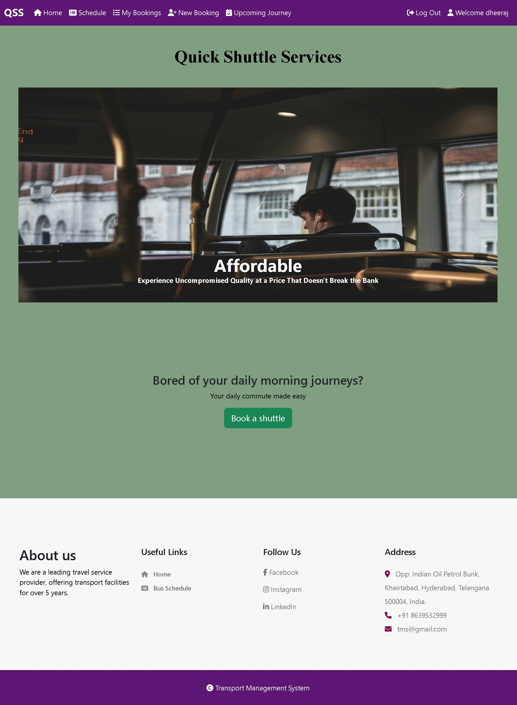
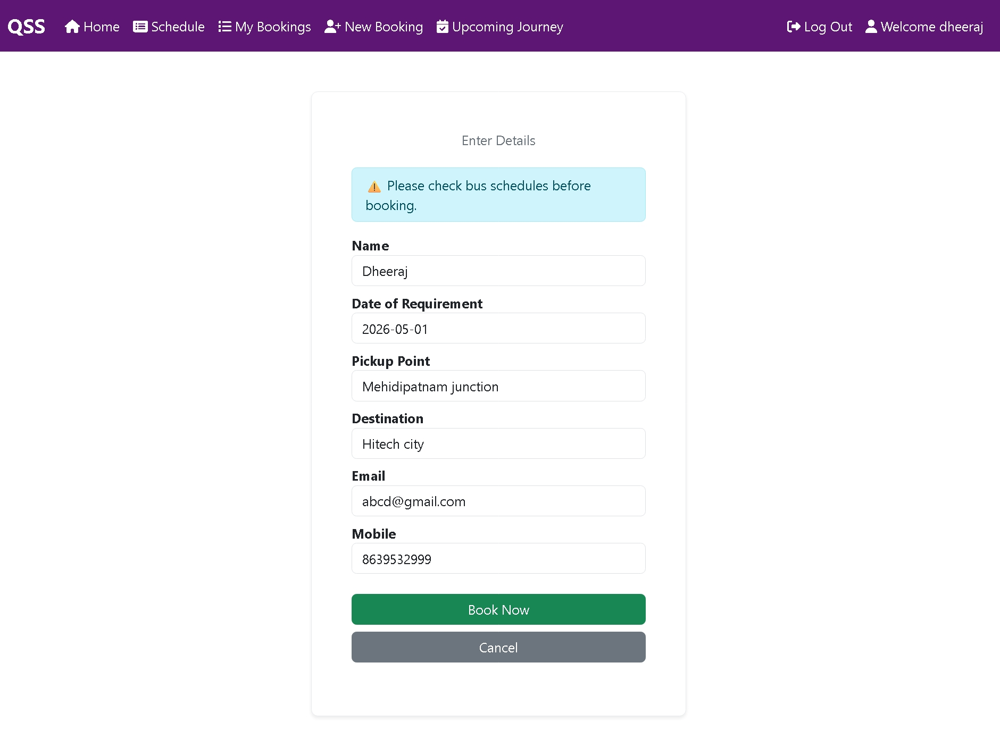
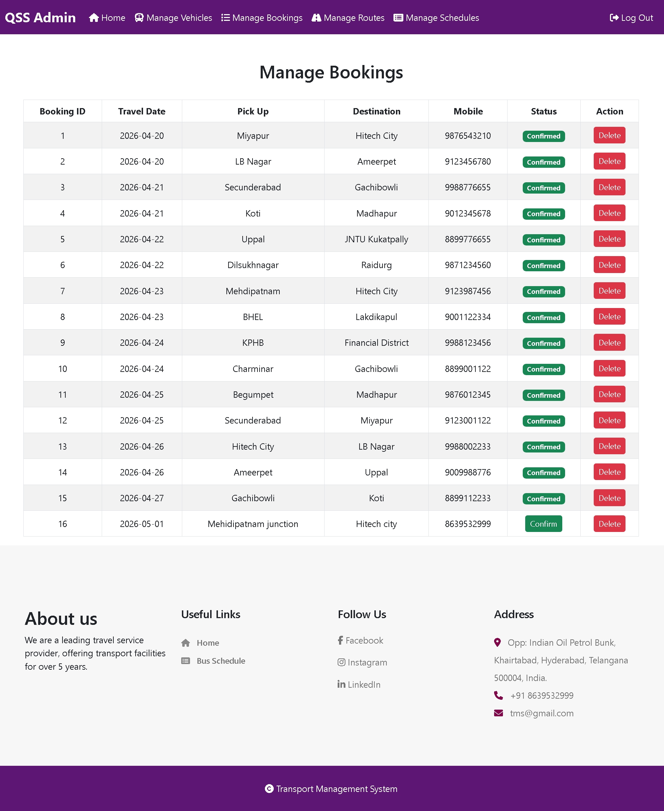
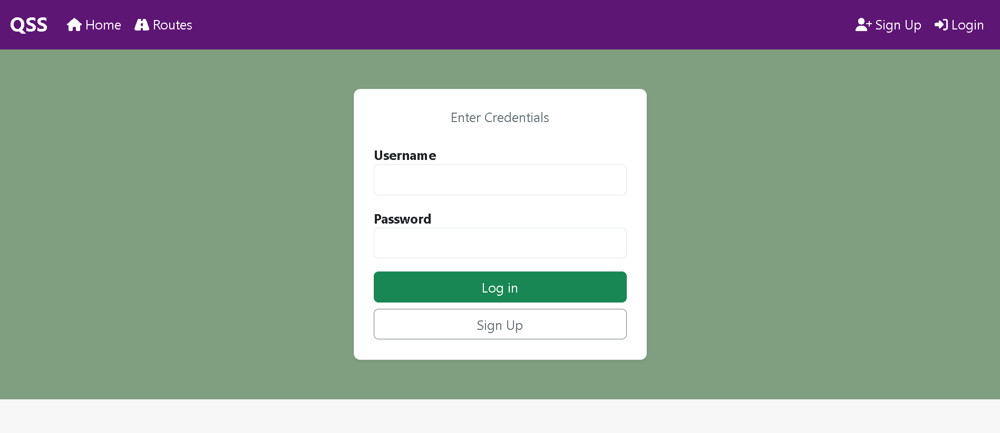
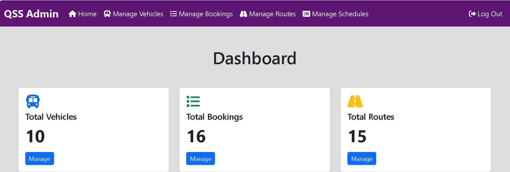

## 📸 Screenshots

### 🏠 Home Page
Landing page where passengers can see available routes and get started.
<p align="center">
  
</p>

### 📅 User Booking
Passengers can book shuttles by giving their date, pickup and destination details.
<p align="center">
  
</p>

### 🛡️ Admin Booking
Admins can view, confirm, or delete passenger bookings from a central dashboard.
<p align="center">
  
</p>

### 🔐 Login
Secure login system for both passengers and admins.
<p align="center">
  
</p>

### 📊 Admin Dashboard
Overview of vehicles, routes, and bookings with live counts.
<p align="center">
  
</p>

---

## ✨ Features

**For Passengers**
- 🔐 Secure signup & login with bcrypt password hashing
- 📅 Book a shuttle with date picker — pickup point to destination
- 📋 View, edit, and delete your own bookings
- 🗓️ See upcoming confirmed journeys at a glance
- 🗺️ Browse all available routes and bus schedules

**For Admins**
- 🛡️ Separate admin login with role-based access control
- 🚌 Full vehicle management — add, update, delete vehicles & drivers
- 📍 Route & schedule management — add stops, update timings
- ✅ Confirm or delete passenger bookings from a central dashboard
- 📊 Dashboard overview with live counts of bookings, vehicles & routes

---

## 🗂️ Project Structure

```
QSS/
├── config/
│   └── db.php
├── helpers/
│   ├── auth.php
│   └── db_helpers.php
├── public/
│   └── assets/
│       ├── css/
│       └── img/
├── views/
│   ├── layout/
│   ├── user/
│   └── admin/
├── actions/
├── database/
│   ├── database.sql
│   └── tables_data.sql
├── .env.example
├── .gitignore
└── README.md
```

---

## ⚙️ Setup & Installation

### Prerequisites
- XAMPP (PHP 8.0+, MySQL)
- Git

### Steps

**1. Clone the repository**
```bash
git clone https://github.com/YOUR-USERNAME/QSS.git
```

**2. Move to XAMPP's web root**
```
Copy the QSS folder into:  C:\xampp\htdocs\QSS
```

**3. Set up the database**
- Start Apache and MySQL in XAMPP Control Panel
- Open http://localhost/phpmyadmin
- Import database/database.sql first, then database/tables_data.sql

**4. Configure environment**
```bash
cp .env.example .env
```
Edit `.env` with your local values:
```
DB_HOST=localhost
DB_USER=root
DB_PASS=
DB_NAME=transport
```

**5. Open the app**
```
http://localhost/QSS/views/user/home.php
```

---

## 🔗 Key Pages

| Page | URL |
|------|-----|
| 🏠 Home | `/views/user/home.php` |
| 🔐 User Login | `/views/user/login.php` |
| 📝 Sign Up | `/views/user/signup.php` |
| 📅 Book a Shuttle | `/views/user/booking.php` |
| 🛡️ Admin Login | `/views/admin/login_admin.php` |
| 📊 Admin Dashboard | `/views/admin/admin.php` |

---

## 🛠️ Tech Stack

| Layer | Technology |
|-------|------------|
| Backend | PHP 8.0+ |
| Database | MySQL via MySQLi |
| Frontend | Bootstrap 5.3 |
| Local Server | XAMPP |
| Version Control | GitHub |

---

## 📁 Database Schema

| Table | Description |
|-------|-------------|
| `users` | Passengers and admins |
| `booking` | Shuttle booking records |
| `route` | Route definitions |
| `schedule` | Bus stop timings |
| `vehicle` | Driver and vehicle registry |

---

<div align="center">

Made by [Dheeraj Kumar Vadla](https://github.com/Dheerajchary)

</div>
